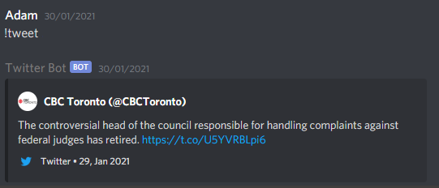

## Twitter Discord Bot

This project allows users to add twitter functionality to a discord bot using the twitter APIs.

Server users can request a random tweet from a twitter account with !tweet. 
The bot will also automatically post new tweets made by the account to a specific discord channel and notify users of the new tweet.

Tweets are displayed as embedded messages; they are styled after the default twitter embedded message created when pasting a tweet's url.

## Project Screen Shots

### Posting new tweets

### Requesting a random tweet

## Installation and Setup Instructions

To run this project, you will need `Python` and `pip` installed globally on your machine.

Start by cloning this repository and following the installation instructions below.

### Installation:

Install pipenv

`pip install pipenv`  

Open the pipenv shell:  

`pipenv shell`  

Install the dependancies:

`pipenv install`  

To run the app:

`py main.py`  

### Environment Variables:

TOKEN - Discord bot token

KEY - Twitter api key

SECRET - Twitter api secret

ACCESS_KEY - Twitter access token

ACCESS_SECRET - Twitter access secret 

USER - User Id of the twitter account you wish to retrieve tweets from

CHANNEL_ID - The Channel Id of the discord channel you wish to post new tweets to
